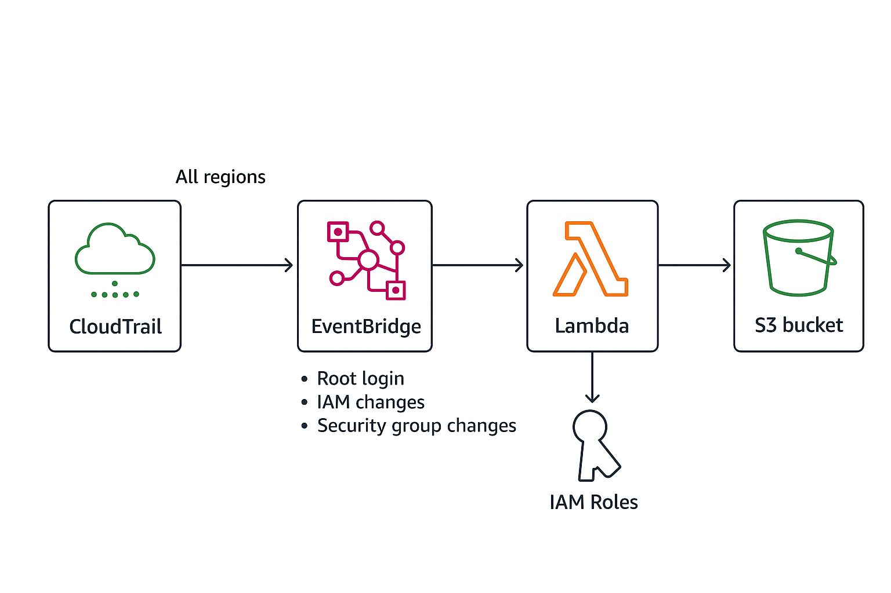

# AWS Serverless Threat Detection Pipeline

A fully serverless pipeline in AWS that detects potential security threats using CloudTrail events, triggers alerts via SNS, and logs data for analysis. This project demonstrates cloud-native security monitoring and automation using Terraform and Lambda.

---

## Table of Contents

- [Project Overview](#project-overview)  
- [Architecture](#architecture)  
- [Features](#features)  
- [Deployment](#deployment)  
- [Testing](#testing)  
- [Folder Structure](#folder-structure)  
- [Technologies](#technologies)  

---

## Project Overview

This Phase 2 project automates threat detection in AWS using serverless services. Key goals:  

- Detect suspicious activities in your AWS account  
- Trigger alerts to designated recipients  
- Maintain a fully automated and scalable architecture  
- Showcase practical cloud security and infrastructure-as-code skills  

---

## Architecture

  

**Components:**  
1. **CloudTrail** – Collects API and console activity logs across all regions  
2. **S3 Bucket** – Stores CloudTrail logs for retention and analysis  
3. **EventBridge** – Listens for security-related events from CloudTrail  
4. **Lambda Function** – Processes events and identifies potential threats  
5. **SNS Topic** – Sends alerts to subscribed emails or endpoints  

---

## Features

- Fully serverless, scalable, and modular  
- Real-time threat detection using CloudTrail events  
- Automated alerting via SNS  
- Configured using Terraform for reproducible infrastructure  
- Easily extendable for additional threat types or monitoring  

---

## Deployment

1. **Clone the repository:**  
   ```bash
   git clone https://github.com/MoiseGermain/aws-serverless-threat-detection.git
   cd aws-serverless-threat-detection/terraform

2. **Initialize Terraform:**

````bash
terraform init
````


3. **Validate configuration:**

````bash
terraform validate
````

4. **Deploy resources:**
````bash
terraform apply -auto-approve
````

## Testing

- Confirm SNS email subscription and accept the confirmation email

- Trigger a test event in AWS EventBridge or CloudTrail

- Check Lambda execution logs in CloudWatch

- Alerts will be sent to the subscribed SNS endpoints

## Folder Structure
aws-serverless-threat-detection/
├── lambda/        # Threat detector Lambda code
├── terraform/     # Terraform infrastructure code
├── diagrams/      # Architecture diagrams
├── examples/      # Sample events for testing
├── README.md
└── LICENSE


## Technologies
- AWS Services: CloudTrail, Lambda, S3, SNS, EventBridge

- Infrastructure as Code: Terraform

- Programming Language: Python 3.9

- Version Control: Git / GitHub
